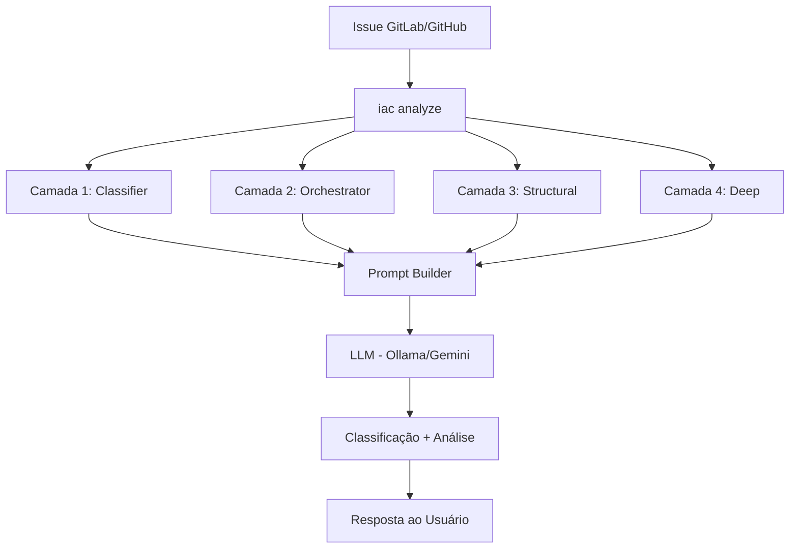
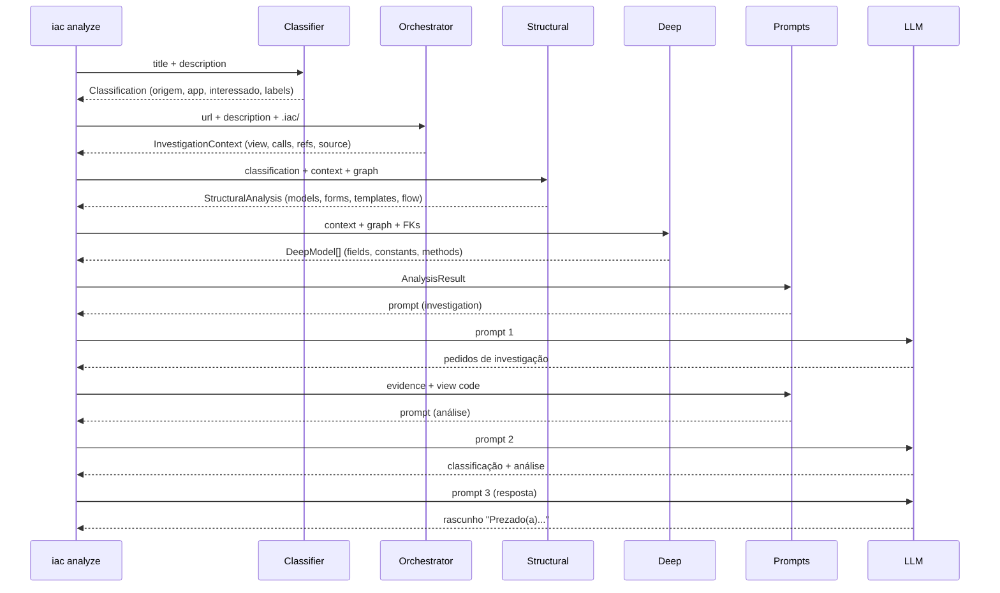

# Arquitetura — Incident Analyst Agent (IAC)

## Visão geral



## Pipeline de análise



## Estrutura do projeto

```
src/iac/
├── __init__.py
├── models.py                  # Contratos de dados (Pydantic)
├── cli.py                     # Entry point CLI
├── config/
│   ├── settings.py            # Load/save .iac/ files
│   ├── app_settings.py        # AppSettings (Pydantic Settings)
│   └── tracer.py              # (deprecado)
├── inspector/
│   ├── detector.py            # Detecta framework (Django/Flask)
│   ├── django.py              # Parser AST Django
│   ├── structure.py           # Gera structure.json
│   └── graph.py               # Gera graph.json
├── agent/
│   ├── tools.py               # 7 ferramentas de navegação
│   ├── orchestrator.py        # analyze_issue + investigate + deep
│   └── prompts.py             # Prompts para LLM
├── analyzer/
│   ├── classifier.py          # Classificação sem LLM
│   └── simulator.py           # (stub)
├── responder/
│   └── generator.py           # (stub)
├── integrations/
│   ├── gitlab.py              # Client GitLab
│   ├── ollama.py              # Backend Ollama
│   └── gemini.py              # Backend Gemini
└── diagram/
    ├── generator.py            # Dados para D3.js
    └── templates/
        ├── overview.html
        └── app_detail.html
```

## Artefatos gerados (.iac/)

```
.iac/
├── project.json       # Framework, versão, settings
├── structure.json     # Mapa de apps/views/models/forms/admin/urls
├── graph.json         # Grafo de dependências (arestas tipadas)
├── config.yaml        # Configurações do projeto (LLM, GitLab)
├── logs/
│   └── iac.log        # Log DEBUG completo
└── diagrams/
    ├── overview.html   # Apps como nós
    └── *.html          # Detalhe por app
```

## Tipos de aresta no grafo

| Tipo | De | Para | Exemplo |
|------|-----|------|---------|
| `url_resolves` | URL pattern | View | `/chamado/<id>/` → `visualizar_chamado` |
| `model_usage` | View | Model | `view` → `Chamado` |
| `method_call` | View | Model.method | `view` → `Chamado.get_permissoes` |
| `form_usage` | View | Form | `view` → `ComunicacaoFormFactory` |
| `form_model` | Form | Model | `ItemForm` → `Item` (Meta.model) |
| `renders` | View | Template | `view` → `chamado.html` |
| `field_definition` | Model | Field | `Chamado` → `Chamado.status` |
| `model_relation` | Model | Model | `Chamado` → `Servico` (FK) |
| `admin_register` | Admin | Model | `ChamadoAdmin` → `Chamado` |
| `admin_form` | Admin | Form | `ProdutoAdmin` → `ProdutoForm` |
| `admin_inline` | Admin | Admin | `Admin` → `InlineAdmin` |

## Perfis de contexto

| Perfil | Modelos | Prompt | Profundidade | Métodos |
|--------|---------|--------|-------------|---------|
| small | 7B | ~10K chars | 2 níveis | Nomes |
| medium | 14-32B | ~20K chars | 2 níveis | Código |
| large | 70B+/APIs | ~28K chars | 3 níveis | Código |
