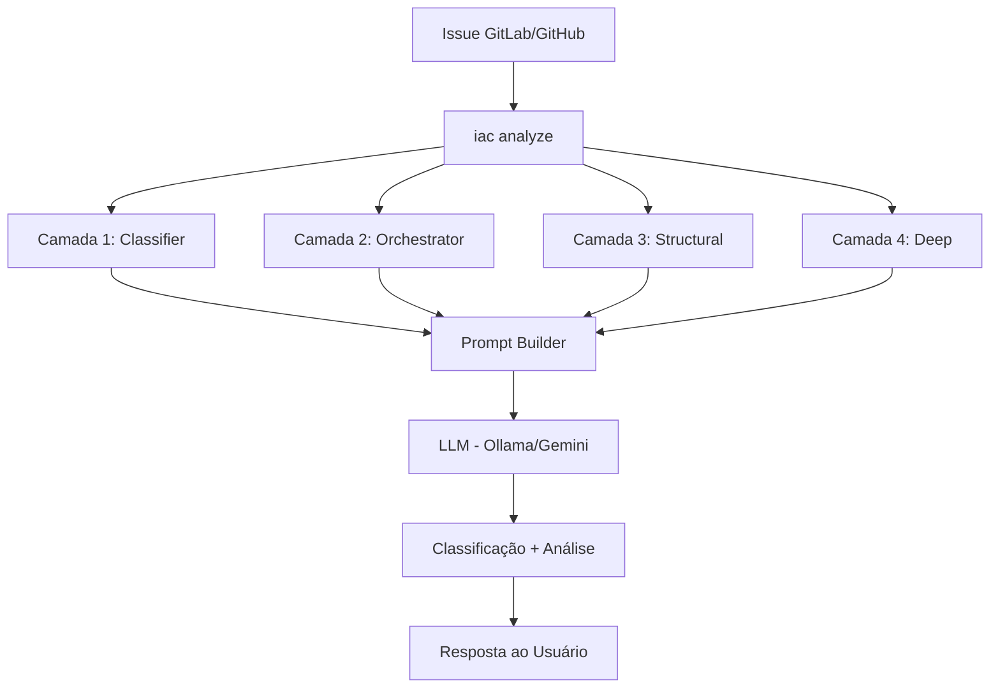
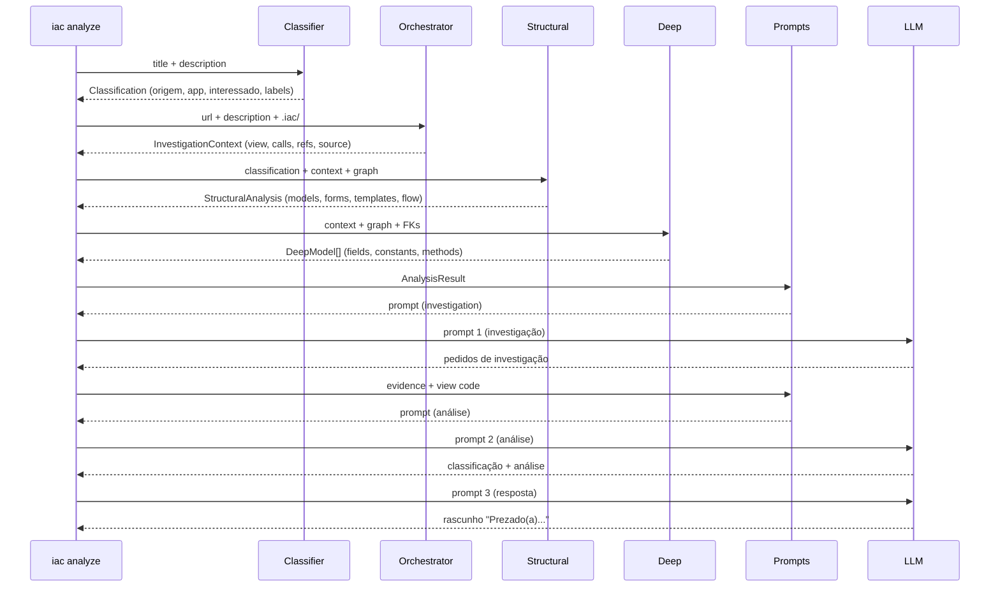

# Arquitetura — Incident Analyst Agent (IAC)

Agente de análise técnica de incidentes de software. Investiga código, reconstrói fluxos, classifica causa e propõe resolução com resposta operacional estruturada.

## Princípios — Arquitetura AI-Native

Este projeto segue os 6 princípios da [Arquitetura AI-Native](https://lemon.dev.br/pt/blog/arquitetura-ai-native-sistemas-ia), adaptados para uma CLI de análise de código + LLM.

| Princípio | Aplicação no IAC |
|-----------|-----------------|
| **1. Explícito sobre Implícito** | `AppSettings` com Pydantic Settings, `config.yaml` tipado, perfis de modelo explícitos |
| **2. Módulos < 200 linhas** | `orchestrator.py` decomposto em `investigate.py`, `deep.py`, `structural.py`, `format.py` |
| **3. Contract-First** | Pydantic models: `Classification`, `InvestigationContext`, `StructuralAnalysis`, `DeepModel`, `AnalysisResult` |
| **4. Testes Determinísticos** | 106 testes com fixtures em memória, respostas LLM pré-gravadas (sem Ollama) |
| **5. Sistemas Autodescritivos** | Este documento, docstrings Google style, logging por camada `[Camada N]` |
| **6. Verificação Automatizada** | `ruff` (lint + docstrings), `pytest`, GitHub Actions CI, `.pre-commit-config.yaml` |

Referências: [artigo original](https://lemon.dev.br/pt/blog/arquitetura-ai-native-sistemas-ia), [adaptação siscan-rpa](https://github.com/Prisma-Consultoria/siscan-rpa/pull/577).

## Visão geral



## Pipeline de análise



## Estrutura do projeto

```
src/iac/
├── __init__.py
├── models.py                  # Contratos de dados — Pydantic models (P3)
├── cli.py                     # Entry point CLI (iac init/analyze/diagram/config)
│
├── config/
│   ├── app_settings.py        # AppSettings — Pydantic Settings tipado (P1)
│   └── settings.py            # Load/save .iac/ files + config.yaml
│
├── inspector/                 # Camada 1 — Inspeção estrutural
│   ├── detector.py            # Detecta framework (Django/Flask/FastAPI)
│   ├── django.py              # Façade: build_django_structure() (P2)
│   ├── django_discovery.py    # Descoberta de apps e INSTALLED_APPS
│   ├── django_parser.py       # Parsing AST de módulos Python
│   ├── django_urls.py         # Parsing de urls.py e admin.py
│   ├── django_renders.py      # Enriquecimento de renders de templates
│   ├── structure.py           # Gera structure.json
│   └── graph.py               # Gera graph.json (arestas tipadas)
│
├── agent/                     # Camadas 2-4 — Recuperação e orquestração
│   ├── orchestrator.py        # Façade: analyze_issue() + perfis de modelo (P2)
│   ├── investigate.py         # Camada 2: navegação de código via .iac/ (P2)
│   ├── deep.py                # Camada 4: FKs em profundidade (P2)
│   ├── structural.py          # Camada 3: componentes + fluxo (P2)
│   ├── format.py              # Formatação de contexto para prompts (P2)
│   ├── tools.py               # Façade: 7 ferramentas de navegação (P2)
│   ├── tools_navigation.py    # resolver_rota, localizar_arquivo, ler_funcao
│   ├── tools_inspection.py    # extrair_chamadas, seguir_referencia, listar_imports
│   ├── runner.py              # Runner LLM: single/multi-prompt (P2)
│   └── prompts/               # Pacote de prompts (P2)
│       ├── analysis.py        # Prompt single-prompt (análise completa)
│       ├── multi.py           # Prompts multi-prompt (investigação + evidência)
│       ├── response.py        # Prompt de resposta ao usuário
│       └── utils.py           # Extração de tipo + compactação
│
├── analyzer/
│   ├── classifier.py          # Classificação sem LLM (origem, app, interessado)
│   └── simulator.py           # Simulação em ambiente controlado (stub)
│
├── responder/
│   └── generator.py           # Gerador de resposta ao usuário (stub)
│
├── integrations/
│   ├── gitlab.py              # Client GitLab (buscar issue, postar comentário)
│   ├── ollama.py              # Backend LLM Ollama (local/self-hosted)
│   └── gemini.py              # Backend LLM Google Gemini
│
└── diagram/
    ├── generator.py           # Dados para visualização D3.js
    └── templates/
        ├── overview.html      # Apps como nós (force-directed graph)
        └── app_detail.html    # Detalhe por app (views, models, forms, templates)
```

## Artefatos gerados (.iac/)

```
.iac/
├── project.json       # Framework, versão, settings
├── structure.json     # Mapa de apps/views/models/forms/admin/urls
├── graph.json         # Grafo de dependências (arestas tipadas)
├── config.yaml        # Configurações persistentes (LLM, GitLab, modo)
├── logs/
│   └── iac.log        # Log DEBUG completo (sempre gravado)
└── diagrams/
    ├── overview.html   # Visão geral dos apps
    └── *.html          # Detalhe por app
```

## Contratos de dados (Pydantic models)

```
Classification          → Camada 1 (classifier)
InvestigationContext    → Camada 2 (orchestrator/investigate)
StructuralAnalysis     → Camada 3 (structural)
DeepModel              → Camada 4 (deep)
AnalysisResult         → Resultado completo de analyze_issue()
ModelProfile           → Perfil de contexto por modelo LLM
FlowStep               → Passo no fluxo de interação
Reference              → Referência seguida pelo orchestrator
```

## Tipos de aresta no grafo

| Tipo | De | Para | Exemplo |
|------|-----|------|---------|
| `url_resolves` | URL pattern | View | `/chamado/<id>/` → `visualizar_chamado` |
| `model_usage` | View | Model | `view` → `Chamado` |
| `method_call` | View | Model.method | `view` → `Chamado.get_permissoes` |
| `form_usage` | View | Form | `view` → `ComunicacaoFormFactory` |
| `form_model` | Form | Model | `ItemForm` → `Item` (Meta.model) |
| `renders` | View | Template | `view` → `chamado.html` |
| `field_definition` | Model | Field | `Chamado` → `Chamado.status` |
| `model_relation` | Model | Model | `Chamado` → `Servico` (FK/M2M) |
| `admin_register` | Admin | Model | `ChamadoAdmin` → `Chamado` |
| `admin_form` | Admin | Form | `ProdutoAdmin` → `ProdutoForm` |
| `admin_inline` | Admin | Admin | `Admin` → `InlineAdmin` |

## Perfis de contexto por modelo LLM

| Perfil | Modelos | Prompt | Profundidade FK | Métodos |
|--------|---------|--------|----------------|---------|
| `small` | 7B (qwen2.5:7b) | ~10K chars | 2 níveis | Apenas nomes |
| `medium` | 14-32B | ~20K chars | 2 níveis | Com código |
| `large` | 70B+ / APIs (Gemini, GPT) | ~28K chars | 3 níveis | Com código |

Detecção automática pelo nome do modelo via `get_model_profile()`.

## Modos de operação do LLM

| Modo | Módulo | Contexto enviado | Quando usar |
|------|--------|------------------|-------------|
| `single` | `runner.py` | 1 prompt com tudo: structural + view + refs + deep (constantes + código dos métodos) | Modelos 14B+ que suportam contexto grande (~20K chars) |
| `multi` | `runner.py` | 3 prompts fixos: investigação → análise com evidência → resposta | Modelos 7B — mais estável e previsível |
| `loop` | `loop.py` | Prompt base + iterações incrementais — LLM decide ações (INVESTIGAR, VERIFICAR_BANCO, CLASSIFICAR) | Modelos 14B+ — LLM decide quando parar (max 4 iterações) |
| `auto` | — | small (7B) → `multi`, medium/large (14B+) → `loop` | Default — seleciona pelo perfil do modelo |

`--mode auto` detecta o tamanho do modelo e seleciona o modo mais adequado:
- **7B (small):** `multi` — 3 prompts fixos, resultados mais estáveis
- **14B+ (medium/large):** `loop` — LLM com mais capacidade decide o que investigar

### Modo loop — ações tipadas

O LLM responde com uma ação por iteração:

| Ação | O que faz | Encerra loop? |
|------|-----------|---------------|
| `INVESTIGAR` | Pede mais código → resolve via tools | Não |
| `VERIFICAR_BANCO` | Pede simulação no banco ([#44](https://github.com/jailtoncarlos/incident-analyst-agent/issues/44)) | Não |
| `ALTERAR_CODIGO` | Sugere diff (antes/depois) | Não |
| `CLASSIFICAR` | Análise final + tipo + resolução | **Sim** |

Controles: max 4 iterações, detecção de repetição, forçar CLASSIFICAR na última iteração.

## Estratégia de prompts

Os prompts usam **orientações**, não templates rígidos — o LLM adapta a resposta ao contexto.

**Classificação flexível:** o LLM classifica com `tipo::nome`. Exemplos comuns: `bug`, `configuracao`, `dados-cadastrais`, `prazo-expirado`, `nao-e-erro`. Pode criar labels novos se nenhum se aplica (ex: `tipo::permissao`).

**Correlação descrição ↔ código:** os prompts orientam o LLM a correlacionar a descrição do usuário com constantes e campos do código (ex: "tempo hábil" → `TEMPO_AVALIACAO = 10`).

**Plano de verificação:** o LLM indica o que verificar no banco e como admin para confirmar a hipótese.

**Fluxo com verificação no banco** ([#44](https://github.com/jailtoncarlos/incident-analyst-agent/issues/44)):

```
Prompt 1 (investigação)       → LLM pede código
Prompt 2 (análise parcial)    → LLM analisa + sugere VERIFICAR_BANCO
  ↓ Simulator (banco mascarado)
Prompt 3 (análise final)      → LLM recebe resultado + classifica
Prompt 4 (resposta)           → LLM gera rascunho adaptado ao tipo
```

## Logging

Formato por camada, gravado em `.iac/logs/iac.log` (DEBUG) e terminal (INFO):

```
[Camada 1] Classifier — origem=erro-suap, app=progressao_docente
[Camada 2] Orchestrator — 12 calls, 1 refs, 10 passos
[Camada 3] Structural — 2 models, 1 templates, 6 passos no fluxo
[Camada 4] Deep — 6 models em profundidade
[LLM] Prompt 1 (investigação): 4041 chars → enviando ao ollama
[LLM] send_to_llm: 1014 chars em 114.9s
[LLM] Resposta 1 (investigação): 1014 chars
[LLM] Evidência resolvida: 1912 chars
[LLM] Prompt 2 (análise): 6096 chars
[LLM] send_to_llm: 2310 chars em 214.5s
[Resultado] Classificação: tipo::prazo-expirado
```

## Cenários testados — issue [#16118](https://gitlab.ifrn.edu.br/cosinf/suap/-/work_items/16118)

Classificação esperada: `tipo::prazo-expirado` (prazo de 10 dias para avaliação discente expirou).

| Modelo | Modo | Classificação | Acertou? | Observação |
|--------|------|---------------|----------|------------|
| qwen2.5:7b | single | `tipo::bug` | ❌ | Não correlacionou "tempo hábil" com constante |
| qwen2.5:7b | multi | `tipo::bug` | ❌ | Evidência insuficiente (381 chars) |
| qwen2.5-coder:7b | multi | `tipo::nao-e-erro` | ❌ | Reconheceu filtro mas não correlacionou prazo |
| **qwen2.5-coder:7b** | **multi** | **`tipo::prazo-expirado`** | **✅** | Prompts com orientação + evidência focal |
| qwen2.5-coder:7b | loop v1 | `Bug::Avaliação Não Preenchida` | ❌ | Confundiu TEMPO_PREENCHIMENTO com TEMPO_AVALIACAO |
| qwen2.5-coder:7b | loop v2 | `tipo::permissao-nao-autorizada` | ❌ | Foi direto para CLASSIFICAR sem investigar |
| qwen2.5:14b | single | — | ⏳ | A testar — prompt completo (~20K chars) |
| qwen2.5:14b | multi | — | ⏳ | A testar |
| qwen2.5:14b | loop | — | ⏳ | A testar — auto seleciona este |

Detalhes de cada execução: [issue #15](https://github.com/jailtoncarlos/incident-analyst-agent/issues/15).

Nota: modelos 7B são não-determinísticos — mesma entrada pode dar resultados diferentes entre execuções. Por isso, `auto` usa `multi` para 7B (mais estável) e `loop` para 14B+ (mais capaz).

## Qualidade de código

- **Lint:** `ruff` com 11 categorias de regras (E, F, W, I, N, UP, S, B, SIM, PIE, D)
- **Docstrings:** Google convention obrigatória (`pydocstyle`)
- **Tamanho de módulo:** `pylint` com `max-module-lines=400` (`.pylintrc`)
- **Testes:** 106 testes unitários + fixtures determinísticos
- **CI:** GitHub Actions (ruff + pylint + pytest em cada push)
- **Pre-commit:** `ruff-format` + `ruff check` + `pylint` (tamanho de módulo)
