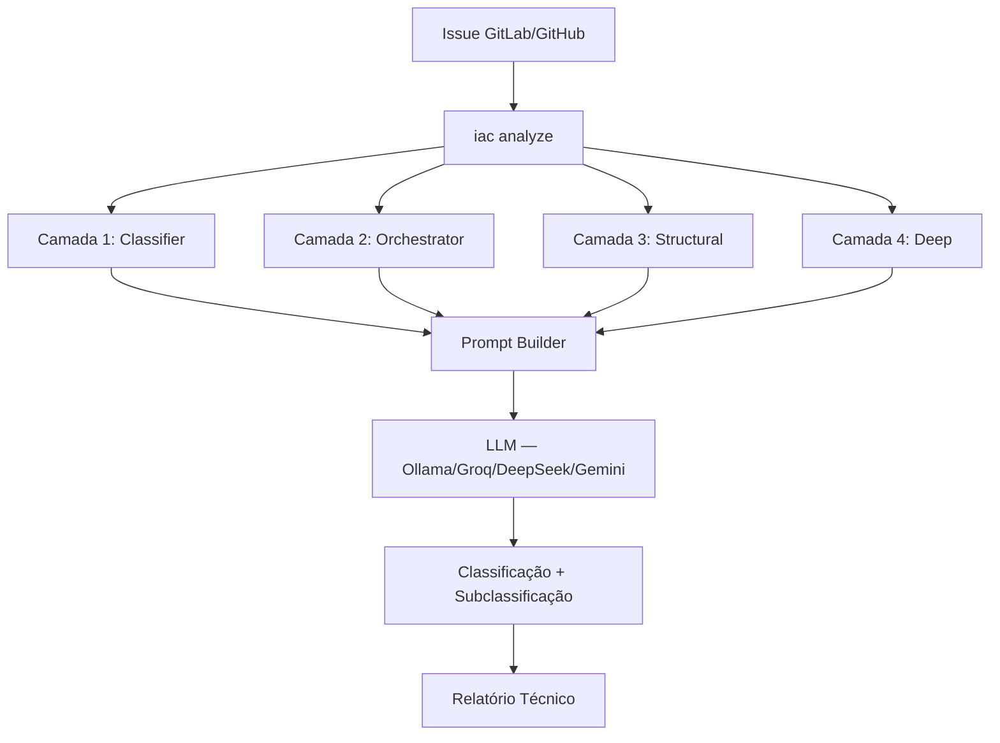
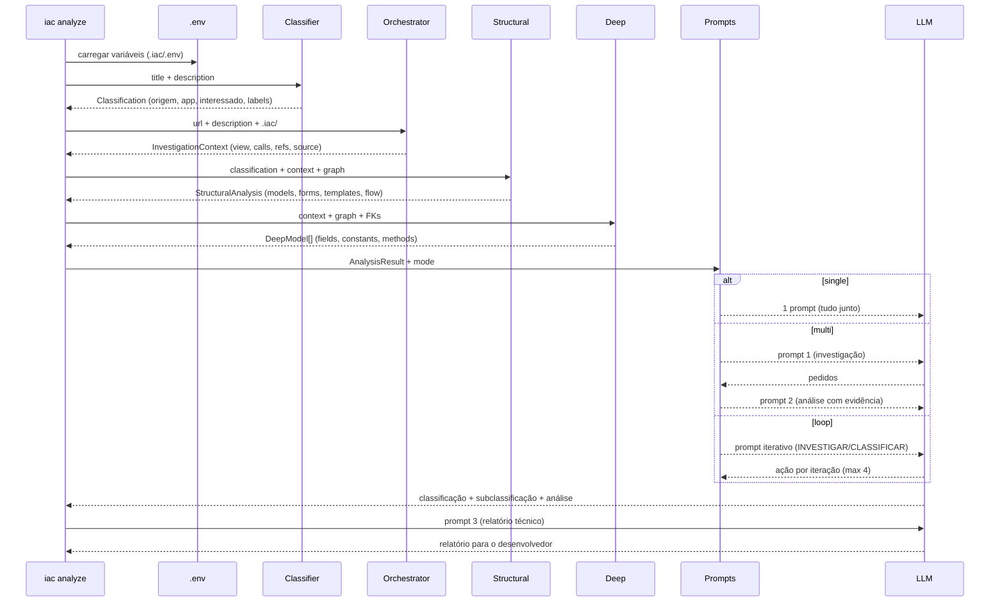

# Arquitetura — Incident Analyst Agent (IAC)

Agente de análise técnica de incidentes de software. Investiga código, reconstrói fluxos, classifica causa e propõe resolução com relatório técnico estruturado.

## Princípios — Arquitetura AI-Native

Este projeto segue os 6 princípios da [Arquitetura AI-Native](https://lemon.dev.br/pt/blog/arquitetura-ai-native-sistemas-ia), adaptados para uma CLI de análise de código + LLM.

| Princípio | Aplicação no IAC | Score |
|-----------|-----------------|-------|
| **1. Explícito sobre Implícito** | `profile.yaml` configurável por projeto (taxonomia, rules, issue_patterns), `.env` com variáveis, `MODEL_PROFILES` explícitos | ✅ |
| **2. Módulos < 400 linhas** | `orchestrator.py` decomposto em 6 módulos, prompts em pacote próprio, pylint `max-module-lines=400` | ✅ |
| **3. Contract-First** | Pydantic models: `Classification`, `InvestigationContext`, `StructuralAnalysis`, `DeepModel`, `AnalysisResult` | ⚠️ parcial |
| **4. Testes Determinísticos** | 198 testes com fixtures em memória, respostas LLM mockadas, testes de integração e end-to-end do init | ✅ |
| **5. Sistemas Autodescritivos** | `.iac/structure.json`, `.iac/profile.yaml`, `docs/ARCHITECTURE.md`, docstrings Google style, logging por camada | ✅ |
| **6. Verificação Automatizada** | `ruff` (lint + docstrings), `pylint` (tamanho), `pytest`, GitHub Actions CI, `.pre-commit-config.yaml` | ✅ |

Scorecard detalhado: [issue #36](https://github.com/jailtoncarlos/incident-analyst-agent/issues/36#issuecomment-4212053047).

## Visão geral



## Pipeline de análise



## Estrutura do projeto

```
src/iac/
├── __init__.py
├── models.py                  # Contratos de dados — Pydantic models
├── cli.py                     # Entry point CLI (iac init/analyze/diagram/config)
│
├── config/
│   ├── app_settings.py        # AppSettings — Pydantic Settings + env vars
│   └── settings.py            # Load/save .iac/ files, profile.yaml, .env
│
├── defaults/                  # Templates genéricos (copiados pelo iac init)
│   ├── env.template           # Template do .env (todas as variáveis)
│   ├── profile.yaml           # Defaults de merge (taxonomy + aliases)
│   └── profile.init.yaml      # Template do profile (vazio com orientações)
│
├── inspector/                 # Camada 1 — Inspeção estrutural
│   ├── detector.py            # Detecta framework (Django/Flask/FastAPI)
│   ├── django.py              # Façade: build_django_structure()
│   ├── django_discovery.py    # Descoberta de apps e INSTALLED_APPS
│   ├── django_parser.py       # Parsing AST de módulos Python
│   ├── django_urls.py         # Parsing de urls.py e admin.py
│   ├── django_renders.py      # Enriquecimento de renders de templates
│   ├── structure.py           # Gera structure.json
│   └── graph.py               # Gera graph.json (arestas tipadas)
│
├── agent/                     # Camadas 2-4 — Recuperação e orquestração
│   ├── orchestrator.py        # Façade: analyze_issue() + MODEL_PROFILES
│   ├── investigate.py         # Camada 2: navegação de código via .iac/
│   ├── deep.py                # Camada 4: FKs em profundidade
│   ├── structural.py          # Camada 3: componentes + fluxo
│   ├── format.py              # Formatação de contexto para prompts
│   ├── tools.py               # Façade: 7 ferramentas de navegação
│   ├── tools_navigation.py    # resolver_rota, localizar_arquivo, ler_funcao
│   ├── tools_inspection.py    # extrair_chamadas, seguir_referencia, listar_imports
│   ├── runner.py              # Runner LLM: single/multi/loop/auto + rate limit
│   ├── loop.py                # Loop interativo com guardrails
│   └── prompts/               # Pacote de prompts
│       ├── analysis.py        # Prompt single-prompt (com ajuste progressivo)
│       ├── multi.py           # Prompts multi-prompt (investigação + evidência)
│       ├── response.py        # Prompt de relatório técnico para o dev
│       └── utils.py           # Extração de tipo (taxonomia via profile)
│
├── analyzer/
│   ├── classifier.py          # Classificação sem LLM (genérico, padrões via profile)
│   └── simulator.py           # Simulação em ambiente controlado (stub — #44)
│
├── integrations/
│   ├── gitlab.py              # Client GitLab (buscar issue, postar comentário)
│   ├── ollama.py              # Backend LLM Ollama (local, timeout 1200s)
│   ├── groq.py                # Backend LLM Groq (gratuito, retry 429/413)
│   ├── deepseek.py            # Backend LLM DeepSeek ($5 grátis, retry 429/413)
│   └── gemini.py              # Backend LLM Google Gemini
│
└── diagram/
    ├── generator.py           # Dados para visualização D3.js
    └── templates/
        ├── overview.html      # Apps como nós (force-directed graph)
        └── app_detail.html    # Detalhe por app
```

## Configuração

Dois arquivos no `.iac/` do projeto inspecionado:

### `.env` — variáveis de ambiente (tokens, backend, rate limit)

```bash
GITLAB_TOKEN=glpat-...
IAC_LLM_BACKEND=groq
IAC_LLM_MODEL=llama-3.3-70b-versatile
GROQ_API_KEY=gsk_...
IAC_ANALYZE_MODE=multi
IAC_LLM_RATE_DELAY=30
```

Hierarquia: `.env` → variáveis de ambiente → CLI args (CLI tem prioridade).
Template completo: `.env.example` na raiz do IAC.

### `profile.yaml` — perfil do projeto (genérico, configurável por cliente)

```yaml
name: "meu-projeto"
system_description: "Django"
issue_patterns:                    # Padrões de template de issue
  title_regex: '^Erro\s+(\d+)...'
  origin_name: "erro-sistema"
app_aliases:                       # Nomes no título → app no código
  Ensino: edu
url_skip_segments: [djtools]       # Específicos do projeto (além dos defaults)
rules:                             # Heurísticas injetadas nos prompts
  - "Se descrição menciona 'prazo', priorize constantes temporais"
taxonomy:                          # Tipos + aliases (merge com defaults)
  aliases:
    tipo::meu-alias: tipo::bug
```

O `iac init` gera um profile **vazio com orientações**. Seções não definidas usam defaults genéricos do IAC (6 known_tipos, 18 aliases, 5 url_skip_segments).

Merge: `defaults/profile.yaml` (base) + `.iac/profile.yaml` (projeto sobrescreve/amplia):
- `system_description`, `rules`: projeto sobrescreve
- `issue_patterns`, `app_aliases`: merge (default + projeto)
- `url_skip_segments`: **união**
- `taxonomy.known_tipos`: **união**
- `taxonomy.aliases`: merge (projeto tem prioridade)

## Artefatos gerados pelo `iac init`

```
.iac/
├── project.json           # Framework, versão, settings (inspeção)
├── structure.json         # Mapa de apps/views/models/forms/admin/urls
├── graph.json             # Grafo de dependências (arestas tipadas)
├── .env                   # Template de configuração (comentado)
├── profile.yaml           # Perfil do projeto (vazio com orientações)
├── logs/                  # Diretório para logs de execução
│   └── iac_YYYYMMDD_HHMMSS.log
└── diagrams/              # Visualizações interativas D3.js
    ├── overview.html      # Visão geral dos apps
    └── {app}.html         # Detalhe por app detectado
```

## Primeira execução (`iac init`)

```bash
$ cd /caminho/do/meu-projeto
$ iac init
Inspecionando /caminho/do/meu-projeto...
Inspeção concluída: Django 5.2 — 15 apps, 120 views, 85 models
  → .iac/.env (template de configuração)
  → .iac/profile.yaml (perfil do projeto — customize para seu sistema)
  → .iac/diagrams/ (16 visualizações interativas)
```

Após o init, o operador edita `.iac/.env` (tokens, backend LLM) e `.iac/profile.yaml` (padrões de issue, app_aliases, rules, taxonomy do seu projeto).

### Testes do init (22 testes)

| Artefato | Teste unitário | Teste E2E |
|----------|---------------|-----------|
| `.env` | gerado com variáveis, não sobrescreve | todas as variáveis presentes |
| `profile.yaml` | vazio, com orientações, nome do projeto | seções vazias, comentários |
| `project.json` | — | existe |
| `structure.json` | — | existe com apps detectados |
| `graph.json` | — | existe com edges |
| `logs/` | criado | existe |
| `diagrams/overview.html` | — | existe |
| `diagrams/{app}.html` | — | por app detectado |

## Backends LLM

| Backend | Comando | Modelos | Custo | Velocidade |
|---------|---------|---------|-------|------------|
| **ollama** | `--llm ollama` | qwen2.5-coder:7b/14b | Grátis (local, CPU/GPU) | ~10-20 min (CPU) |
| **groq** | `--llm groq` | llama-3.3-70b, llama-4-scout-17b, qwen3-32b | Grátis (rate limit) | ~1-3s |
| **deepseek** | `--llm deepseek` | deepseek-coder, deepseek-chat | $5 grátis | ~5-15s |
| **gemini** | `--llm gemini` | gemini-2.5-pro, gemini-2.5-flash | 25-1500 req/dia grátis | ~5-15s |

### Rate limit e fallbacks

| Situação | Comportamento |
|----------|--------------|
| **413 (prompt too large)** | Retorna `PROMPT_TOO_LARGE` → run_single retenta sem deep |
| **429 (rate limit)** | Retry com backoff (parse do tempo de espera) |
| **Throttling silencioso** | `IAC_LLM_RATE_DELAY` espaça chamadas |
| **Sem API key** | Erro claro com instrução da variável de ambiente |

## Modos de operação do LLM

| Modo | Prompts | Quando usar | Guardrails |
|------|---------|-------------|------------|
| `single` | 1 prompt | Modelos MoE (17B+) | Ajuste progressivo (413 → sem deep) |
| `multi` | 3 fixos | Modelos 8B — mais estável | Parse rejeita expressões complexas |
| `loop` | Iterativo | Modelos 14B+ | min_iterations, repair prompt, taxonomia |
| `auto` | Detecta | Default | small→multi, medium/large→loop |

### Guardrails do loop

| Guardrail | O que faz |
|-----------|-----------|
| `_detect_action()` tolerante | Reconhece CLASSIFICAR com markdown, sozinho, por seções |
| `min_iterations=2` | Impede classificação prematura na 1ª iteração |
| `normalize_to_known()` | Mapeia labels fora do catálogo (ex: avaliacao-nao-disponivel → prazo-expirado) |
| Repair prompt | Se resposta tem análise mas não classificou, pede só CLASSIFICAÇÃO |
| `_enrich_on_repeat()` | Máximo 4 métodos focais quando LLM repete investigação |

### Taxonomia (configurável via profile.yaml)

Labels conhecidos (defaults): `bug`, `configuracao`, `dados-cadastrais`, `prazo-expirado`, `nao-e-erro`, `permissao`.

Aliases (defaults, 18 mapeamentos): labels criativos do LLM são normalizados:
- `avaliacao-nao-disponivel`, `tempo-expirado`, `tempo-habil-para-avaliacao` → `prazo-expirado`
- `logica-incorreta`, `validacao-falhada`, `erro-de-codigo` → `bug`
- `comportamento-esperado` → `nao-e-erro`
- `acesso-negado`, `sem-permissao` → `permissao`

O parser aceita labels **com ou sem** prefixo `tipo::` (ex: `bug` → `tipo::bug`).

Clientes podem adicionar tipos e aliases no `profile.yaml → taxonomy`.

## Tipos de aresta no grafo

| Tipo | De | Para | Exemplo |
|------|-----|------|---------|
| `url_resolves` | URL pattern | View | `/chamado/<id>/` → `visualizar_chamado` |
| `model_usage` | View | Model | `view` → `Chamado` |
| `method_call` | View | Model.method | `view` → `Chamado.get_permissoes` |
| `form_usage` | View | Form | `view` → `ComunicacaoFormFactory` |
| `form_model` | Form | Model | `ItemForm` → `Item` (Meta.model) |
| `renders` | View | Template | `view` → `chamado.html` |
| `field_definition` | Model | Field | `Chamado` → `Chamado.status` |
| `model_relation` | Model | Model | `Chamado` → `Servico` (FK/M2M) |
| `admin_register` | Admin | Model | `ChamadoAdmin` → `Chamado` |
| `admin_form` | Admin | Form | `ProdutoAdmin` → `ProdutoForm` |
| `admin_inline` | Admin | Admin | `Admin` → `InlineAdmin` |

## Perfis de contexto por modelo LLM

| Perfil | Modelos | Deep | Profundidade FK | Métodos |
|--------|---------|------|----------------|---------|
| `small` | ≤8B (qwen:7b, llama:8b) | Omitido no single | 2 níveis | Apenas nomes |
| `medium` | 9-35B (qwen:14b, qwen3:32b) | Incluído | 2 níveis | Com código |
| `large` | 36B+ / APIs (70b, Gemini, GPT) | Incluído | 3 níveis | Com código |

Detecção automática pelo nome do modelo via `get_model_profile()`.

## Cenários testados — Groq (issue #57)

Issue de teste: [gitlab#16118](https://gitlab.ifrn.edu.br/cosinf/suap/-/work_items/16118) — Erro 9645 - Progressão Docente.
Classificação esperada: `tipo::nao-e-erro / tipo::prazo-expirado`.

| Modelo | single | multi | loop | Melhor modo |
|--------|--------|-------|------|-------------|
| **llama-3.1-8b** | tipo::bug ❌ | **tipo::nao-e-erro ✅** | ⚠️ parcial | **multi** |
| **llama-4-scout-17b** | **tipo::nao-e-erro / prazo-expirado ✅✅** | tipo::bug ❌ | ⚠️ parcial | **single** |
| **qwen3-32b** | 413 ❌ | tipo::bug ❌ | None ❌ | nenhum (rate limit) |
| **llama-3.3-70b** | 413 ❌ | **tipo::nao-e-erro ✅** | ⚠️ parcial | **multi** |

Padrão emergente:
- **8B:** multi é o melhor modo
- **17B MoE (Llama 4):** single funciona — MoE foca melhor
- **70B:** multi é o melhor modo (single bate em rate limit)
- **loop:** promissor em todos, labels fora do catálogo

Detalhes: [issue #15](https://github.com/jailtoncarlos/incident-analyst-agent/issues/15) (Ollama), [issue #57](https://github.com/jailtoncarlos/incident-analyst-agent/issues/57) (Groq).

## Logging

Formato por camada, gravado em `.iac/logs/iac_YYYYMMDD_HHMMSS.log` (DEBUG) e terminal (INFO):

```
[Camada 1] Classifier — origem=erro-sistema, app=loja
[Camada 2] Orchestrator — 12 calls, 2 refs, 13 passos
[Camada 3] Structural — 2 models, 1 templates, 6 passos no fluxo
[Camada 4] Deep — 11 models em profundidade
[LLM] Rate delay: 30s
[LLM] Modo single-prompt: 5740 chars (deep=False) → enviando ao groq
[LLM] send_to_llm: 1722 chars em 1.4s
[Resultado] Classificação: tipo=tipo::nao-e-erro, subtipo=tipo::prazo-expirado
```

## Qualidade de código

- **Lint:** `ruff` com 11 categorias de regras (E, F, W, I, N, UP, S, B, SIM, PIE, D)
- **Docstrings:** Google convention obrigatória (`pydocstyle`)
- **Tamanho de módulo:** `pylint` com `max-module-lines=400` (`.pylintrc`)
- **Testes:** 198 testes (unitários + integração + regressão + E2E do init)
- **CI:** GitHub Actions (ruff + pylint + pytest em cada push)
- **Pre-commit:** `ruff-format` + `ruff check` + `pylint` (tamanho de módulo)

## Milestones

| Milestone | Estado | Issues |
|-----------|--------|--------|
| [v0.1 — Inspeção e Análise](https://github.com/jailtoncarlos/incident-analyst-agent/milestone/1) | ✅ fechada | 19 fechadas |
| [v0.2 — Qualidade da Análise LLM](https://github.com/jailtoncarlos/incident-analyst-agent/milestone/3) | em aberto | #7, #39, #50, #58, #62, #64 |
| [v0.3 — Simulação e Verificação](https://github.com/jailtoncarlos/incident-analyst-agent/milestone/4) | em aberto | #4, #6, #8, #44, #59, #60 |
| [v0.4 — Aprendizado (RAG)](https://github.com/jailtoncarlos/incident-analyst-agent/milestone/5) | em aberto | #55 |
| [v1.0 — Chatbot Conversacional](https://github.com/jailtoncarlos/incident-analyst-agent/milestone/6) | em aberto | #56 |
| [Casos de Teste](https://github.com/jailtoncarlos/incident-analyst-agent/milestone/7) | em aberto | #14-32, #40 |

## Evolução planejada

```
Atual:  Core genérico + profile.yaml por cliente + 4 backends + 4 modos + guardrails
v0.2:   Melhorar análise LLM (#58 DeepSeek, #62 core genérico, #64 hardcoded restantes)
v0.3:   + Simulação no banco (#44) + Relatório unificado (#60) + Gemini produção (#59)
v0.4:   + RAG com issues já respondidas (#55)
v1.0:   + Chatbot conversacional (#56)
Futuro: + Fine-tuning / DPO quando dataset suficiente (#55)
```
