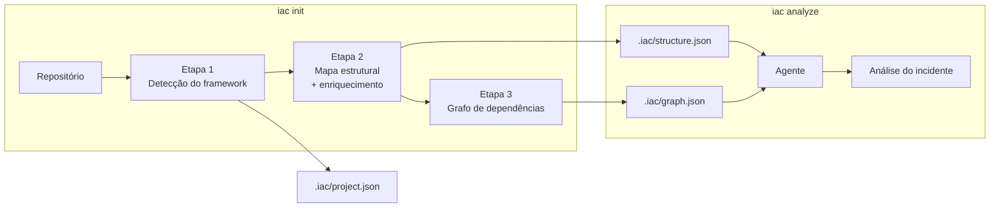
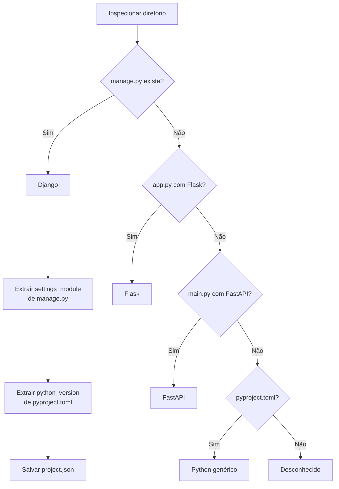
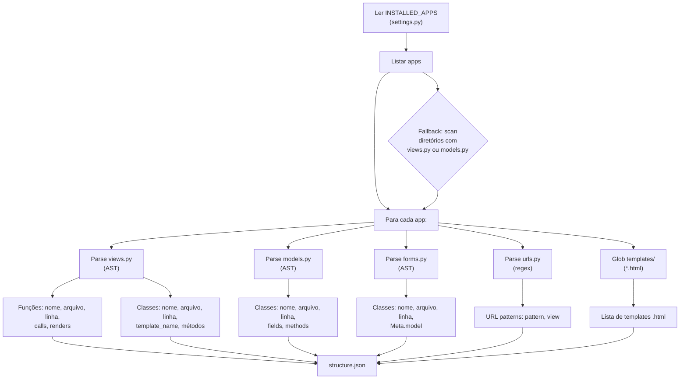
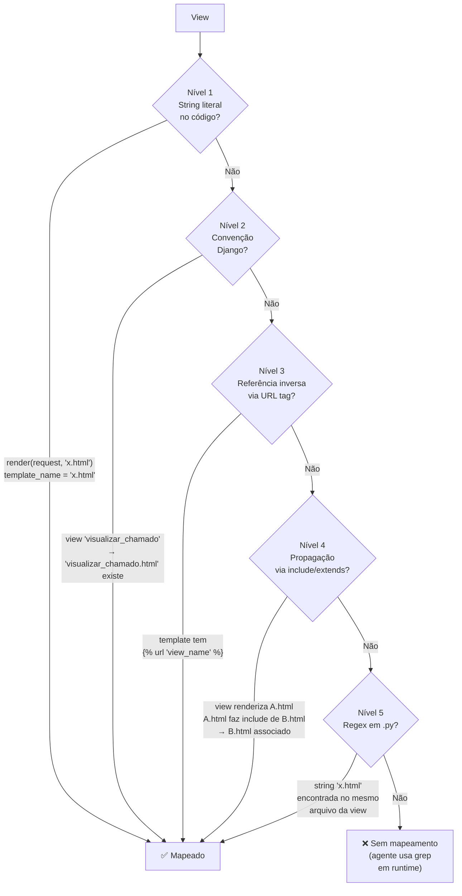
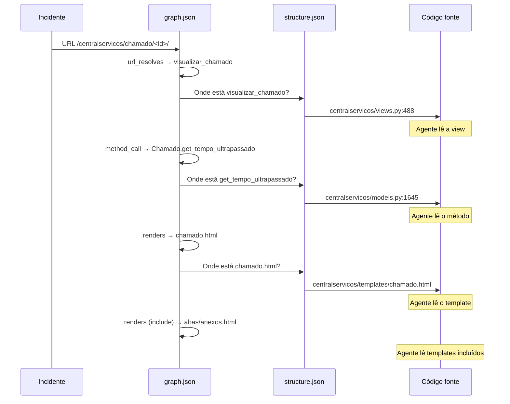
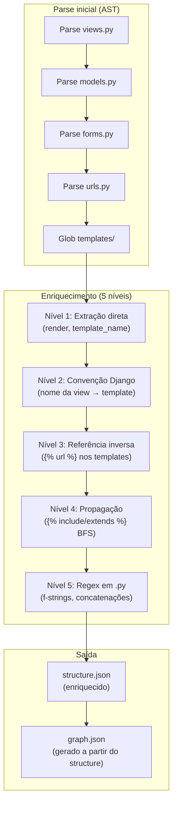

# Estratégia de Inspeção de Repositório

Este documento descreve como o `iac init` inspeciona um repositório de código e constrói os artefatos que o agente usa para analisar incidentes.

## Visão geral



A inspeção gera três artefatos em `.iac/`, cada um com responsabilidade distinta:

| Artefato | Pergunta que responde | Conteúdo | Tamanho típico |
|----------|----------------------|----------|----------------|
| `project.json` | *Que tipo de projeto é?* | Framework, versão Python, settings | ~200 bytes |
| `structure.json` | *O que existe?* (inventário) | Apps, views, models, forms, URLs, templates e seus atributos | ~2-5 MB |
| `graph.json` | *Como se conecta?* (relações) | Arestas tipadas entre componentes (URL→view, view→model, etc.) | ~5-15 MB |

Quando o agente recebe um incidente, ele usa `graph.json` para descobrir **o caminho** (URL → view → model → método) e `structure.json` para **localizar e ler** cada componente no caminho.

---

## Etapa 1 — Detecção do framework



**Saída:** `project.json`

```json
{
  "framework": "django",
  "settings_module": "suap.settings",
  "python_version": ">=3.14.3",
  "base_dir": "/opt/suap",
  "inspected_at": "2026-04-07T16:27:32Z"
}
```

---

## Etapa 2 — Mapa estrutural (structure.json)

O mapa estrutural é o **inventário** de todos os componentes do projeto. A construção acontece em duas fases: parse inicial (AST) e enriquecimento (5 níveis de resolução de renders).

### Fase 2a — Parse inicial

Para Django, o parse via AST segue este fluxo:



### Extração por componente

| Componente | Método | O que extrai |
|-----------|--------|-------------|
| **Views** | `ast.parse` → `FunctionDef`, `ClassDef` | nome, arquivo:linha, chamadas internas, templates renderizados |
| **Models** | `ast.parse` → `ClassDef` com campos `*Field` | nome, arquivo:linha, campos (CharField, FK, etc.), métodos públicos |
| **Forms** | `ast.parse` → `ClassDef` com `class Meta` | nome, arquivo:linha, Meta.model referenciado |
| **URLs** | Regex em `urls.py` | padrão de URL, view associada |
| **Templates** | `glob('templates/**/*.html')` | lista de arquivos .html |

### Fase 2b — Enriquecimento: resolução de renders (view → template)

A resolução de qual template uma view usa é o aspecto mais complexo da inspeção. Um template pode ser referenciado de muitas formas diferentes no código Django. Para maximizar a cobertura, a resolução acontece em **5 níveis complementares**, cada um capturando um padrão diferente:



**Nível 1 — Extração direta (AST):**
Busca strings literais de template em:
- Chamadas: `render()`, `render_to_string()`, `TemplateResponse()`, `get_template()`
- Keywords: `template_name='...'`, `template='...'`
- Atributos de classe: `template_name = '...'` em class-based views

**Nível 2 — Convenção Django (heurística):**
Cruza nome da view com templates existentes no app:
- `visualizar_chamado` → `visualizar_chamado.html`
- `visualizar_chamado` → `centralservicos/visualizar_chamado.html`
- `visualizar_chamado` → `chamado.html` (remove prefixos `listar_`, `visualizar_`, `editar_`, etc.)

**Nível 3 — Referência inversa via `` (templates):**
Percorre os templates buscando ``. Se um template referencia uma view, essa view provavelmente está relacionada ao template.

**Nível 4 — Propagação via `` e `` (BFS):**
Se uma view já renderiza `erro.html` e `erro.html` faz ``, o template `abas/anexos.html` é associado à view. A propagação é feita via BFS (busca em largura), seguindo a cadeia de includes recursivamente.

A resolução de paths usa matching flexível (`_resolve_template_ref`):
- Match direto: `abas/anexos.html`
- Strip de prefixo: `erros/templates/abas/anexos.html` → `abas/anexos.html`
- Match por basename: `relatorio_pdf.html` → busca global em todos os apps

**Nível 5 — Regex em arquivos `.py`:**
Busca strings terminadas em `.html` nos arquivos Python do app, capturando referências que o AST não detecta (f-strings, concatenações, variáveis, chamadas dinâmicas). Associa ao template existente mais próximo usando o mesmo matching flexível.

### Cobertura observada (SUAP, 1.909 templates únicos)

| Nível | Técnica | Templates cobertos | Cobertura |
|-------|---------|-------------------|-----------|
| 1 | Extração direta (AST) | 44 | 2% |
| 1b | + Atributos de classe (CBV) | ~90 | 5% |
| 2 | + Convenção Django | ~600 | 31% |
| 3 | + Referência inversa () | 1.092 | 57% |
| 4 | + Propagação include/extends (BFS) | 1.281 | 67% |
| 5 | + Regex em .py | **1.370** | **71%** |

Os 29% não cobertos são:
- **~14%** — Templates órfãos (não referenciados em nenhum lugar — possivelmente obsoletos)
- **~15%** — Referências muito dinâmicas (variáveis construídas em runtime, lógica condicional complexa)

O máximo teórico alcançável (excluindo órfãos) é **~87%**.

---

## Etapa 3 — Grafo de dependências (graph.json)

O grafo é construído percorrendo o `structure.json` (já enriquecido) e criando arestas tipadas entre componentes.

```mermaid
graph TD
    URL["URL pattern\n/chamado/&lt;id&gt;/"]
    VIEW["View\nvisualizar_chamado"]
    MODEL["Model\nChamado"]
    METHOD["Method\nget_tempo_ultrapassado"]
    FIELD["Field\ndata_limite_atendimento"]
    FORM["Form\nComunicacaoFormFactory"]
    TEMPLATE["Template\nchamado.html"]
    INCLUDE["Template (include)\nabas/anexos.html"]

    URL -->|url_resolves| VIEW
    VIEW -->|model_usage| MODEL
    VIEW -->|method_call| METHOD
    VIEW -->|form_usage| FORM
    VIEW -->|renders| TEMPLATE
    VIEW -.->|renders (via include)| INCLUDE
    MODEL -->|field_definition| FIELD
    MODEL -->|method_definition| METHOD
    FORM -->|form_model| MODEL
```

### Tipos de aresta

| Tipo | De | Para | Como é detectado |
|------|-----|------|-----------------|
| `url_resolves` | URL pattern | View | Parse de `urls.py` com normalização `views.func` → `func` |
| `model_usage` | View | Model | Chamadas `Model.objects.*` no corpo da view |
| `method_call` | View | Model.method | Chamadas `obj.method()` onde method existe no model |
| `form_usage` | View | Form | Instanciação de Form no corpo da view |
| `form_model` | Form | Model | `class Meta: model = Model` no form |
| `renders` | View | Template | 5 níveis de resolução (ver acima) |
| `field_definition` | Model | Model.field | Campos `*Field` no corpo da classe |

### Como o agente navega o grafo

Quando o agente recebe um incidente com URL `/centralservicos/chamado/516785/`:



O grafo permite que o agente **navegue sem grep** — ele sabe exatamente quais componentes visitar e em qual ordem.

---

## Números de referência (SUAP)

| Métrica | Valor |
|---------|-------|
| Apps mapeados | 94 |
| Views | 3.573 |
| Models | 1.852 |
| Forms | 2.102 |
| URLs | 2.223 |
| Templates | 2.121 |
| **Arestas no grafo** | **56.155** |
| URL → View resolvidas | 1.816 (82%) |
| View → Template cobertos | 1.370 (71%) |
| **Tempo total de inspeção** | **5 segundos** |
| **Tamanho do .iac/** | ~15 MB |

### Distribuição de arestas por tipo

| Tipo | Quantidade | % |
|------|-----------|---|
| `renders` | 22.955 | 41% |
| `method_call` | 14.466 | 26% |
| `field_definition` | 11.798 | 21% |
| `model_usage` | 2.538 | 5% |
| `url_resolves` | 1.816 | 3% |
| `form_usage` | 1.623 | 3% |
| `form_model` | 959 | 2% |

---

## Pipeline de enriquecimento

O enriquecimento do `structure.json` segue um pipeline sequencial onde cada nível complementa o anterior:



Cada nível opera sobre os dados já enriquecidos pelos níveis anteriores. O nível 4 (propagação via include) depende dos renders já mapeados pelos níveis 1-3 para saber quais templates percorrer.

---

## Extensibilidade

O inspector é plugável por framework. Cada framework tem seu parser em `iac/inspector/`:

```
iac/inspector/
├── detector.py      # Detecta o framework (compartilhado)
├── structure.py      # Despacha para o parser correto
├── graph.py          # Constrói grafo (compartilhado)
├── django.py         # Parser Django (implementado)
├── flask.py          # Parser Flask (futuro)
└── fastapi.py        # Parser FastAPI (futuro)
```

Todos os parsers produzem o mesmo formato de `structure.json` — o grafo e o agente trabalham sobre a estrutura padronizada, independente do framework.

---

## Monitoramento (verbose mode)

Para acompanhar o enriquecimento em detalhe, use o modo verbose:

```bash
iac init --force -v
```

Os logs de debug mostram cada template detectado por nível:
```
DEBUG Convenção: centralservicos.visualizar_chamado → ['chamado.html']
DEBUG Template inverso: erro.html → erros.erro
DEBUG Include propagation: +4 templates for view
```
