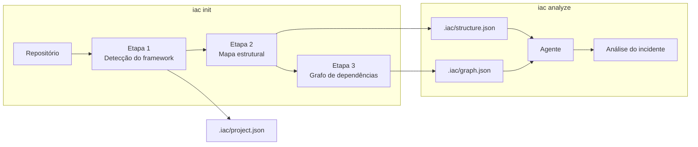
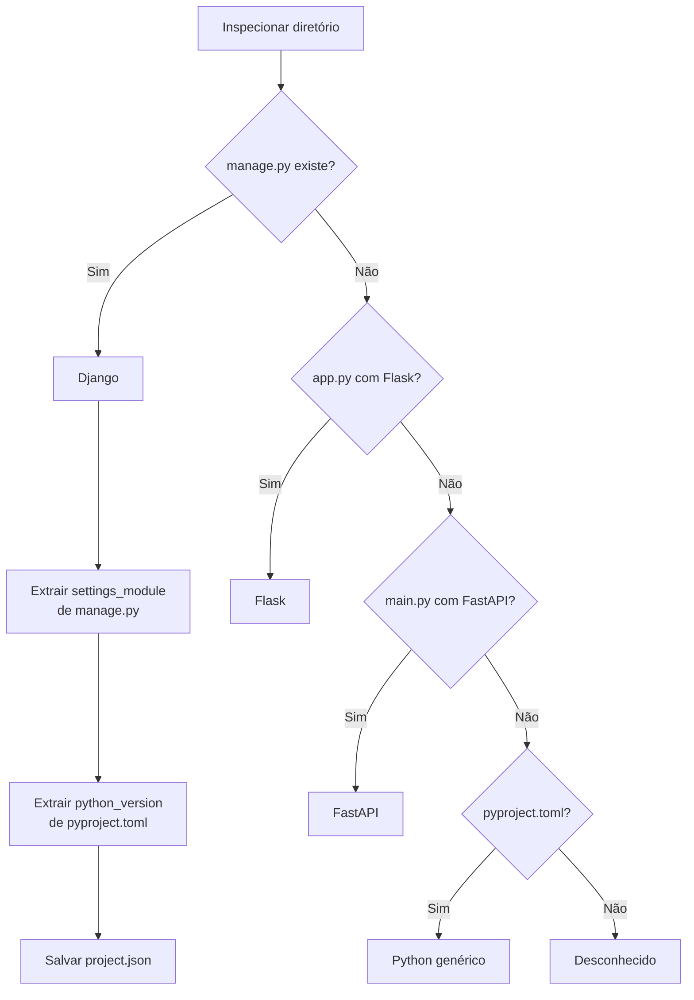
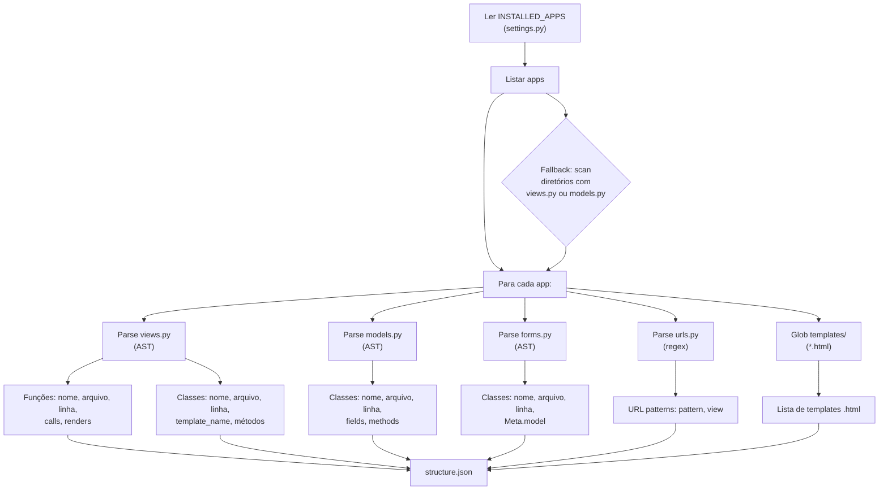
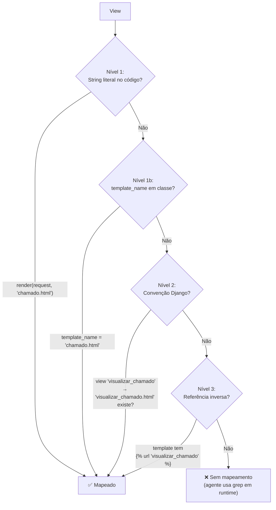
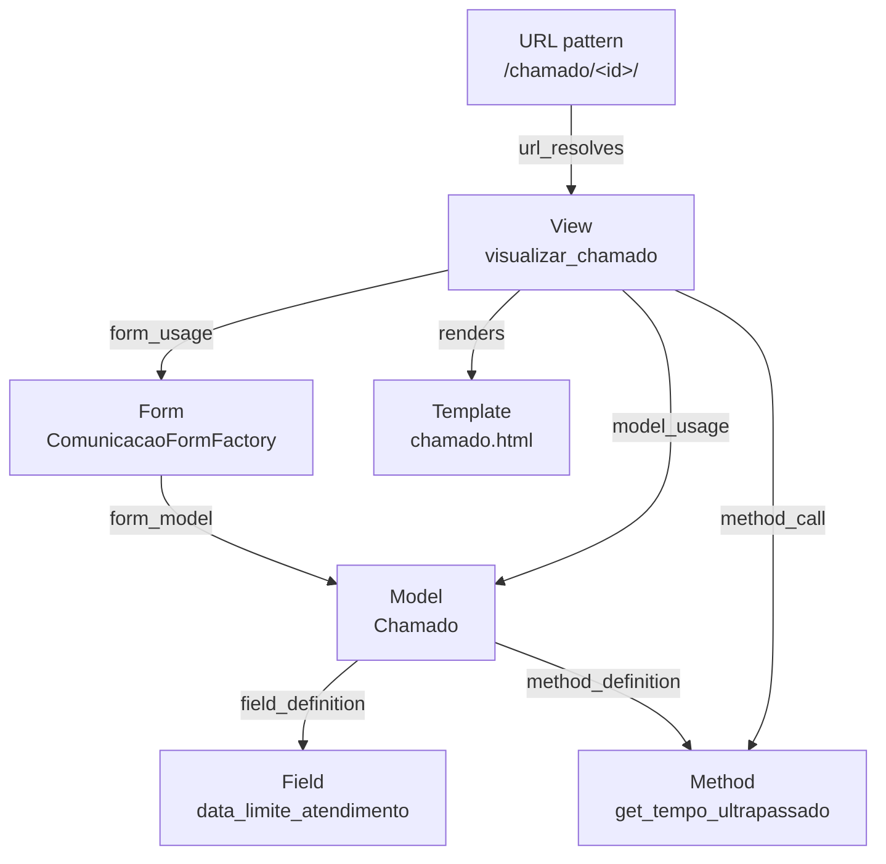
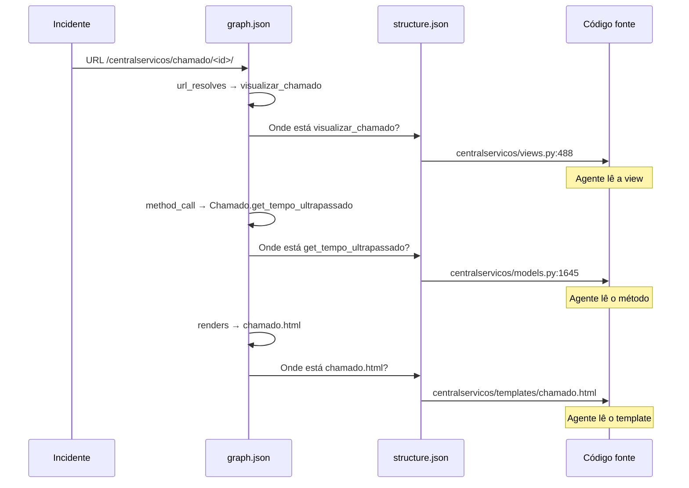

# Estratégia de Inspeção de Repositório

Este documento descreve como o `iac init` inspeciona um repositório de código e constrói os artefatos que o agente usa para analisar incidentes.

## Visão geral



A inspeção gera três artefatos em `.iac/`, cada um com responsabilidade distinta:

| Artefato | Pergunta que responde | Tamanho típico |
|----------|----------------------|----------------|
| `project.json` | *Que tipo de projeto é?* | ~200 bytes |
| `structure.json` | *O que existe?* (inventário) | ~2-5 MB |
| `graph.json` | *Como se conecta?* (relações) | ~3-8 MB |

---

## Etapa 1 — Detecção do framework



**Saída:** `project.json`

```json
{
  "framework": "django",
  "settings_module": "suap.settings",
  "python_version": ">=3.14.3",
  "base_dir": "/opt/suap",
  "inspected_at": "2026-04-07T16:01:49Z"
}
```

---

## Etapa 2 — Mapa estrutural (structure.json)

O mapa estrutural é o **inventário** de todos os componentes do projeto. Para Django, a construção segue este fluxo:



### Extração por componente

| Componente | Método | O que extrai |
|-----------|--------|-------------|
| **Views** | `ast.parse` → `FunctionDef`, `ClassDef` | nome, arquivo:linha, chamadas internas, templates renderizados |
| **Models** | `ast.parse` → `ClassDef` com campos `*Field` | nome, arquivo:linha, campos (CharField, FK, etc.), métodos públicos |
| **Forms** | `ast.parse` → `ClassDef` com `class Meta` | nome, arquivo:linha, Meta.model referenciado |
| **URLs** | Regex em `urls.py` | padrão de URL, view associada |
| **Templates** | `glob('templates/**/*.html')` | lista de arquivos .html |

### Resolução de renders (view → template)

A resolução de qual template uma view usa é feita em 3 níveis complementares:



**Nível 1 — Extração direta (AST):**
Busca strings literais em chamadas `render()`, `render_to_string()`, `TemplateResponse()`, `get_template()` e atribuições `template_name = '...'` (class-based views).

**Nível 2 — Convenção Django (heurística):**
Cruza nome da view com templates existentes:
- `visualizar_chamado` → `visualizar_chamado.html`
- `visualizar_chamado` → `centralservicos/visualizar_chamado.html`
- `visualizar_chamado` → `chamado.html` (sem prefixo `visualizar_`)

**Nível 3 — Referência inversa (templates):**
Percorre os templates buscando `` e mapeia na direção inversa: o template referencia a view, logo a view provavelmente renderiza (ou está relacionada a) esse template.

**Cobertura observada (SUAP, 2121 templates):**

| Nível | renders detectados | Cobertura |
|-------|-------------------|-----------|
| Apenas Nível 1 | 44 | 2% |
| + Nível 1b (class attrs) | ~90 | 4% |
| + Nível 2 (convenção) | ~600 | 28% |
| + Nível 3 (inverso) | **1.280** | **60%** |

---

## Etapa 3 — Grafo de dependências (graph.json)

O grafo é construído percorrendo o `structure.json` e criando arestas tipadas entre componentes.



### Tipos de aresta

| Tipo | De | Para | Como é detectado |
|------|-----|------|-----------------|
| `url_resolves` | URL pattern | View | Parse de `urls.py` |
| `model_usage` | View | Model | Chamadas `Model.objects.*` no corpo da view |
| `method_call` | View | Model.method | Chamadas `obj.method()` onde method existe no model |
| `form_usage` | View | Form | Instanciação de Form no corpo da view |
| `form_model` | Form | Model | `class Meta: model = Model` no form |
| `renders` | View | Template | 3 níveis de resolução (ver acima) |
| `field_definition` | Model | Model.field | Campos `*Field` no corpo da classe |

### Como o agente navega o grafo

Quando o agente recebe um incidente com URL `/centralservicos/chamado/516785/`:



O grafo permite que o agente **navegue sem grep** — ele sabe exatamente quais componentes visitar e em qual ordem.

---

## Números de referência (SUAP)

| Métrica | Valor | Tempo |
|---------|-------|-------|
| Apps mapeados | 94 | — |
| Views | 3.573 | — |
| Models | 1.852 | — |
| Forms | 2.102 | — |
| URLs | 2.223 | — |
| Templates | 2.121 | — |
| Arestas no grafo | 34.480 | — |
| URL → View resolvidas | 1.816 (82%) | — |
| View → Template resolvidas | 1.280 (60%) | — |
| **Tempo total de inspeção** | — | **4 segundos** |
| **Tamanho do .iac/** | 8.5 MB | — |

---

## Extensibilidade

O inspector é plugável por framework. Cada framework tem seu parser em `iac/inspector/`:

```
iac/inspector/
├── detector.py      # Detecta o framework (compartilhado)
├── structure.py      # Despacha para o parser correto
├── graph.py          # Constrói grafo (compartilhado)
├── django.py         # Parser Django (implementado)
├── flask.py          # Parser Flask (futuro)
└── fastapi.py        # Parser FastAPI (futuro)
```

Todos os parsers produzem o mesmo formato de `structure.json` — o grafo e o agente trabalham sobre a estrutura padronizada, independente do framework.
